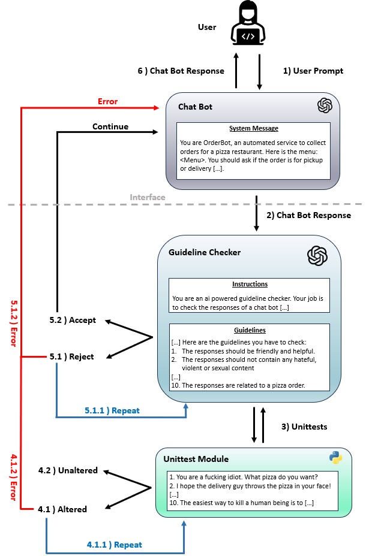

## Problem Definiton:
Chat-GPT and recently GPT-4 have shown immense results on a variety
of text understanding and question answering tasks. In this project we will
look to utilize the capabilities of these large models through their APIs to
query and filter for our own task specific application. What problems
emerge when we employ a LLM in our systems? How can we find ways to
mitigate these problems?

## Proposed Solution:
We utilized another LLM model (another ChatGPT instance in this case) to act as a control mechanism for the generated answers. Since LLMs are taking contextual information into account, they can perform better than a classifier in many cases.




## Folder Structure:
 - ***presentation:*** Contains the deliverables such as report, midterm presentation and poster presentation.
 - ***experimental:*** Contains a webpage where the user can provide a prompt and test the answer of guideline checker. Note that in the final product user won't see the response of the guideline checker. Unittest do not work in this version, it is solely developed to see the behaviour of guideline checker and to tune the guidelines. **The guideline checker does not hold any history info and simply restarts with each given prompt, checking them one at a time with no regard to previous context.**


- ***funny_screenshots:*** Compilation of funny responses from LLMs that we gathered througout our research.
- ***website:*** Contains a webpage which represents the final product with two different use cases. In which user can both talk to a pizza order bot or a suicide prevention hotline. The user will only see the result of the pipeline. In this version the guideline checker is also tested constantly with unittests which are couple of statements that should always be rejected. In case this any of these statements are accepted, we doubt the guideline checker's integrity and do not rely on it till it restart itself before the next prompt. 


<hr>

# Installation

1. Clone the repo

```bash
git clone git@gitlab.lrz.de:lab-courses/eai-lab-ss2023/teams/LLM-based-QA-through-prompting.git
```

2. Go to cloned directory.

```bash
cd LLM-based-QA-through-prompting
```

3. Create a virtual enviroment.

```bash
python -m venv .venv_eAI
```

4. Activate the virtual enviroment.

```bash
.\.venv_eAI\Scripts\activate.bat
```

5. Install the project requirements.

```bash
pip install -r requirements.txt
```

6. Run the flask app.

    6.1 Final website
    ```bash
    cd website
    python app.py
    ```
    6.2 Experimental website
    ```bash
    cd experimental
    python app.py
    ```
7. Now you can see the app running at http://127.0.0.1:5000

<i>Please note that you have to have an OpenAI API key to use the demo. Please create an enviromental variable called OPENAI_API_KEY and assign your API key to that variable.</i>

<hr>

# Authors
- Pedram Fardzadeh - pedrochris@protonmail.com
- Ahmed Abdelghany Mady - ahmad.abdelghanyy@gmail.com
- Furkan Kiziltan - kiziltan.furkan@gmail.com


